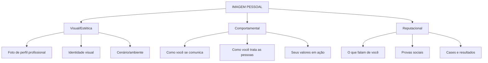

# 🖼️ CONSTRUÇÃO DA IMAGEM MONETIZÁVEL

---

## Os 3 Níveis da Imagem



---

## Identidade Visual Profissional

### Elementos obrigatórios:

#### 1. Paleta de Cores (máximo 5 cores)
| Função | Cor | Código Hex |
|--------|-----|------------|
| Principal | | # |
| Secundária | | # |
| Destaque | | # |
| Neutra clara | | # |
| Neutra escura | | # |

#### 2. Tipografia (máximo 3 fontes)
| Função | Fonte | Uso |
|--------|-------|-----|
| Títulos | | Headlines, destaques |
| Corpo | | Textos longos |
| Destaque | | CTAs, números |

#### 3. Elementos Gráficos
- [ ] Logo principal
- [ ] Logo alternativo (simplificado)
- [ ] Ícone/favicon
- [ ] Padrões/texturas
- [ ] Molduras para fotos
- [ ] Templates de posts

### Ferramentas Recomendadas:
| Ferramenta | Uso | Custo |
|------------|-----|-------|
| Canva Pro | Design geral | R$45/mês |
| Adobe Express | Design rápido | Grátis/Premium |
| Figma | Design profissional | Grátis |
| Coolors | Paleta de cores | Grátis |
| Google Fonts | Tipografia | Grátis |

---

## Fotografia Profissional

### Sessão de fotos essencial:

**Tipos de foto necessárias:**
1. **Foto de perfil** - Rosto claro, sorriso, fundo neutro
2. **Foto editorial** - Corpo inteiro, ambiente profissional
3. **Foto lifestyle** - Você em ação no seu trabalho
4. **Foto casual** - Bastidores, dia a dia
5. **Foto para vendas** - Segurando produto/apontando

**Investimento médio:** R$500 - R$2.000 (sessão completa)

### DIY (Faça você mesmo):
- Celular com boa câmera (iPhone 12+ ou equivalente)
- Ring light (R$80-200)
- Tripé de celular (R$50-100)
- Fundo neutro (parede branca ou tecido)
- Luz natural (janela grande)

---

## Bio Perfeita (Instagram)

### Estrutura da Bio:

```
[QUEM VOCÊ É] + [EMOJI]
[O QUE VOCÊ FAZ/OFERECE]
[PROVA SOCIAL/CREDENCIAL]
[CTA + LINK]
```

### Exemplos por nicho:

**Finanças:**
```
💰 Especialista em Investimentos
📈 Ajudei +500 pessoas a investir do zero
🎯 Método testado e aprovado
👇 Comece agora gratuitamente
```

**Fitness:**
```
🏋️ Personal Trainer | CREF 123456
💪 Transformação em 90 dias
📱 +1.000 alunos online
🔥 Treino grátis no link 👇
```

**Educação:**
```
📚 Professor de Inglês
🌎 Fluência em 6 meses
✈️ +200 alunos no exterior
📲 Aula experimental grátis 👇
```

---

## Construindo Autoridade

### Prova Social:
- [ ] Depoimentos de clientes/alunos
- [ ] Números (seguidores, vendas, alunos)
- [ ] Certificações e diplomas
- [ ] Aparições em mídia
- [ ] Parcerias com marcas conhecidas
- [ ] Cases de sucesso documentados

### Conteúdo de Autoridade:
- [ ] Tutoriais aprofundados
- [ ] Análises e opiniões fundamentadas
- [ ] Previsões e tendências
- [ ] Estudos de caso
- [ ] Entrevistas com experts
- [ ] Conteúdo educativo consistente

---

## 🔗 Links Relacionados
- [[01 - Personal Branding]]
- [[03 - Estrutura Empresarial]]
- [[04 - Monetização Instagram]]

#imagem #identidade-visual #autoridade #branding
