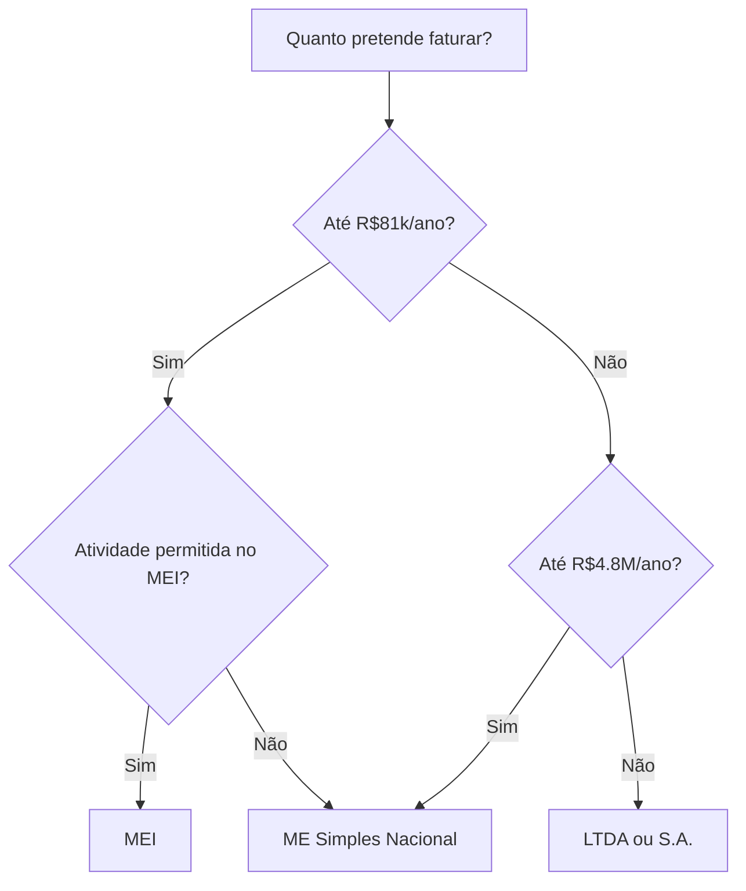

Categoria: [[PLANEJAMENTO - Organizau{00e7}u{00e3}o e direu{00e7}u{00f5}es]]

# 🏢 ESTRUTURA EMPRESARIAL COMPLETA

---

## Escolhendo o Tipo de Empresa

### Comparativo Completo:

| Aspecto | MEI | ME (Simples) | LTDA |
|---------|-----|--------------|------|
| **Faturamento máximo** | R$81.000/ano | R$4.800.000/ano | Ilimitado |
| **Funcionários** | 1 | 9-49 | Ilimitado |
| **Sócios** | Não permite | Opcional | Obrigatório (ou EIRELI) |
| **Custo mensal** | ~R$70 (DAS) | Varia (6-19%) | Varia (regime) |
| **Contabilidade** | Dispensa | Obrigatória | Obrigatória |
| **Abertura** | Grátis, online | R$500-2.000 | R$1.000-3.000 |
| **Complexidade** | Muito fácil | Média | Alta |

### Fluxograma de Decisão:



---

## Abrindo um MEI (Passo a Passo)

### Requisitos:
- [ ] CPF regularizado
- [ ] Não ser sócio ou titular de outra empresa
- [ ] Não ser servidor público federal
- [ ] Atividade permitida no MEI

### Passo a passo:

**1. Acesse o Portal do Empreendedor**
```
https://www.gov.br/empresas-e-negocios/pt-br/empreendedor
```

**2. Clique em "Quero ser MEI"**

**3. Faça login com Gov.br**

**4. Preencha os dados:**
- Nome fantasia
- Atividades (CNAEs)
- Endereço comercial
- Telefone e email

**5. Escolha os CNAEs corretos para criadores de conteúdo:**
| CNAE | Descrição |
|------|-----------|
| 7319-0/04 | Consultor de publicidade |
| 7311-4/00 | Agências de publicidade |
| 9001-9/99 | Artista independente |
| 8599-6/99 | Instrutor independente |
| 6319-4/00 | Portais, provedores de conteúdo |

**6. Conclua e salve o CCMEI**

### Após abrir o MEI:
- [ ] Emitir Certificado de Condição de MEI (CCMEI)
- [ ] Cadastrar na prefeitura (alvará)
- [ ] Abrir conta PJ
- [ ] Configurar emissão de NFS-e

---

## Conta Bancária PJ

### Melhores opções para criadores:

| Banco | Mensalidade | Pix | Cartão | Vantagens |
|-------|-------------|-----|--------|-----------|
| **Nubank PJ** | Grátis | Grátis | Grátis | Mais simples |
| **Inter PJ** | Grátis | Grátis | Grátis | Investimentos |
| **C6 Bank PJ** | Grátis | Grátis | Grátis | Pontos |
| **Cora** | Grátis | Grátis | Grátis | Gestão financeira |
| **iugu** | Grátis | Grátis | - | Cobranças recorrentes |

### Documentos necessários:
- [ ] CCMEI ou Contrato Social
- [ ] RG e CPF
- [ ] Comprovante de endereço
- [ ] Selfie com documento

---

## Emissão de Nota Fiscal

### Para MEI:

**NFS-e (Nota Fiscal de Serviço Eletrônica):**

1. Acesse o portal da prefeitura da sua cidade
2. Cadastre-se como emissor
3. Emita nota para cada serviço prestado

**Campos obrigatórios:**
- Dados do tomador (cliente)
- Descrição do serviço
- Valor
- CNAE da atividade

### Quando emitir nota:
| Situação | Emitir NF? |
|----------|------------|
| Venda para pessoa física | Não obrigatório* |
| Venda para empresa (PJ) | OBRIGATÓRIO |
| Recebimento de plataforma BR | Depende |
| Recebimento do exterior | Não aplicável |

*Recomendado emitir sempre para ter controle

### Modelo de descrição para NF:

```
Serviços de criação de conteúdo digital para redes sociais, 
incluindo produção de [X] posts/vídeos para o período de 
[DATA] a [DATA], conforme contrato de prestação de serviços.
```

---

## Contratos Essenciais

### 1. Contrato de Prestação de Serviços (Publi/Parceria)

**Cláusulas obrigatórias:**
- [ ] Identificação das partes
- [ ] Objeto do contrato (o que será feito)
- [ ] Prazo de entrega
- [ ] Valor e forma de pagamento
- [ ] Direitos de uso da imagem
- [ ] Exclusividade (se houver)
- [ ] Condições de cancelamento
- [ ] Foro para disputas

### 2. Termo de Uso de Imagem

```
TERMO DE AUTORIZAÇÃO DE USO DE IMAGEM

Eu, [NOME], portador do CPF [XXX], AUTORIZO o uso da minha 
imagem, voz e nome em materiais publicitários, promocionais 
e educacionais produzidos por [EMPRESA], pelo período de 
[TEMPO] / por tempo indeterminado, para veiculação em 
[MEIOS].

Esta autorização é concedida a título [GRATUITO/ONEROSO no 
valor de R$ XXX].

[Local], [Data]
[Assinatura]
```

### 3. Política de Privacidade e Termos de Uso

**Para quem vende online - OBRIGATÓRIO por lei:**
- Política de Privacidade (LGPD)
- Termos de Uso
- Política de Reembolso

---

## 🔗 Links Relacionados
- [[02 - Construção da Imagem]]
- [[11 - Gestão Financeira]]
- [[Ideas Extraordinárias - Monetização e Escala]]

#empresa #mei #cnpj #nota-fiscal #contratos
