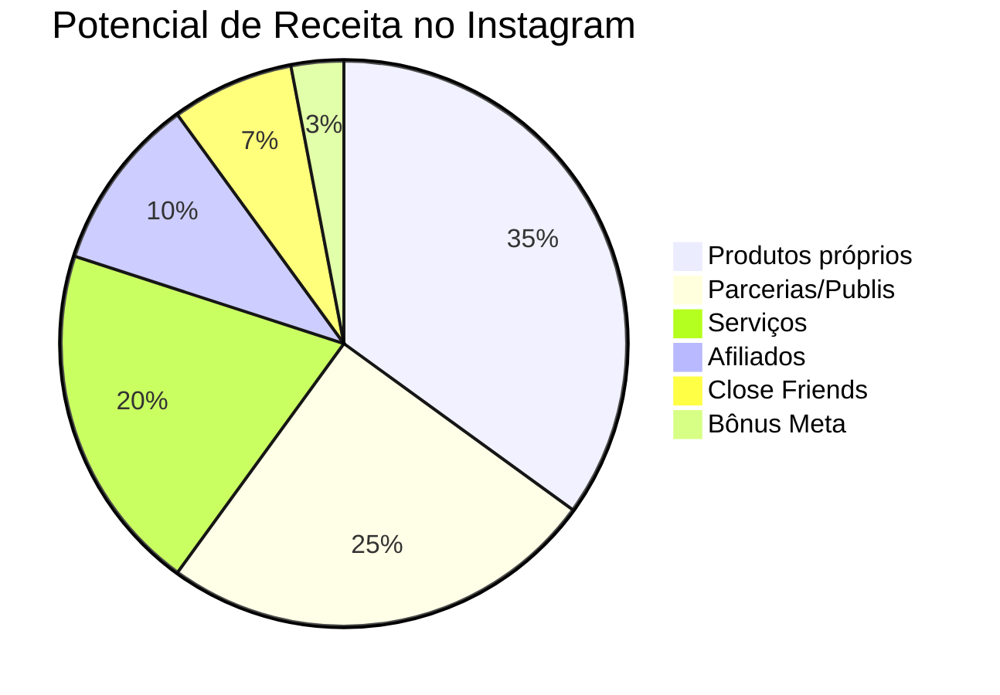

# 📸 MONETIZAÇÃO INSTAGRAM - GUIA DEFINITIVO

---

## Visão Geral das Fontes de Receita



---

## Parcerias e Publiposts

### Tipos de parceria:

| Tipo | Descrição | Pagamento |
|------|-----------|-----------|
| **Permuta** | Troca por produto/serviço | Produto |
| **Publipost** | Post pago único | R$ fixo |
| **Embaixador** | Parceria longa (3-12 meses) | R$ mensal |
| **Collab** | Criação conjunta | Divisão/exposição |
| **Afiliado** | Comissão por venda | % das vendas |

### Como precificar publipost:

**Fórmula básica:**
```
VALOR = (Seguidores × 0,05) + (Engajamento% × 100) + Nicho Premium
```

**Tabela de referência 2026:**

| Seguidores | Valor Stories | Valor Feed | Valor Reels |
|------------|---------------|------------|-------------|
| 1k-10k | R$100-300 | R$200-500 | R$300-800 |
| 10k-50k | R$300-800 | R$500-1.500 | R$800-2.500 |
| 50k-100k | R$800-2.000 | R$1.500-4.000 | R$2.500-6.000 |
| 100k-500k | R$2.000-5.000 | R$4.000-10.000 | R$6.000-15.000 |
| 500k-1M | R$5.000-15.000 | R$10.000-30.000 | R$15.000-50.000 |
| 1M+ | R$15.000+ | R$30.000+ | R$50.000+ |

**Fatores que aumentam o valor:**
- ✅ Nicho premium (finanças, tech, luxo)
- ✅ Alta taxa de engajamento (+5%)
- ✅ Audiência qualificada/nichada
- ✅ Histórico de conversão comprovado
- ✅ Exclusividade
- ✅ Direitos de uso estendidos

### Como conseguir parcerias:

**1. Media Kit Profissional**

Inclua:
- [ ] Sobre você/marca
- [ ] Estatísticas atualizadas
- [ ] Demografia da audiência
- [ ] Cases de sucesso
- [ ] Formatos disponíveis
- [ ] Tabela de preços
- [ ] Contato

**2. Prospecção ativa**

```
Olá [NOME]! 

Sou [SEU NOME], criador de conteúdo sobre [NICHO] com uma 
comunidade engajada de [X] seguidores.

Acompanho a [MARCA] há algum tempo e admiro muito [ALGO 
ESPECÍFICO]. Acredito que minha audiência tem muito fit 
com o perfil de vocês.

Gostaria de propor uma parceria de conteúdo. Posso enviar 
meu Media Kit com mais detalhes?

Obrigado!
```

**3. Plataformas de conexão:**
- Influency.me
- Squid
- Digital Influencers
- Airfluencers

---

## Close Friends Pago

### O que oferecer:

| Conteúdo | Frequência | Valor sugerido |
|----------|------------|----------------|
| Bastidores exclusivos | Diário | R$19-29/mês |
| Conteúdo antecipado | 2-3x semana | R$29-49/mês |
| Dicas premium | Diário | R$39-69/mês |
| Mentoria light | Diário + interação | R$97-197/mês |
| Comunidade + conteúdo | Diário + lives | R$147-297/mês |

### Como vender:

**1. Plataformas de gestão:**
- Close Friends (app)
- Lastlink
- Hotmart Club
- Kiwify

**2. Estrutura de venda:**
```
OFERTA CLOSE FRIENDS

🔐 O que você recebe:
✅ [Benefício 1]
✅ [Benefício 2]
✅ [Benefício 3]
✅ [Benefício 4]

💰 Investimento: R$ XX/mês
📲 Acesso imediato após pagamento

🔗 Link na bio
```

---

## Loja no Instagram

### Configuração:

1. **Requisitos:**
- [ ] Conta comercial/criador
- [ ] Cumprir políticas do Meta
- [ ] Produtos físicos ou digitais permitidos
- [ ] Catálogo configurado

2. **Configurar catálogo:**
- Acesse o Gerenciador de Comércio
- Conecte ou crie um catálogo
- Adicione produtos
- Vincule ao Instagram

3. **Boas práticas:**
- Fotos de alta qualidade
- Descrições detalhadas
- Preços claros
- Variações (tamanho, cor)
- Tags nos posts

---

## Afiliados no Instagram

### Melhores programas:

| Programa | Comissão | Nicho | Cookie |
|----------|----------|-------|--------|
| Amazon | 1-10% | Geral | 24h |
| Hotmart | 20-80% | Info | 60-180 dias |
| Monetizze | 20-80% | Info | 60-180 dias |
| Kiwify | 20-80% | Info | Vitalício |
| Shopee | 5-15% | Geral | 7 dias |
| Shein | 10-20% | Moda | 30 dias |
| Magalu | 5-12% | Geral | 7 dias |

### Estratégias de conversão:

1. **Review genuíno** - Use e mostre resultados reais
2. **Comparativo** - Compare produtos similares
3. **Tutorial** - Ensine usando o produto
4. **Unboxing** - Mostre a experiência de receber
5. **Cupom exclusivo** - Ofereça desconto da sua parceria

---

## Bônus e Programa de Monetização Meta

### Requisitos atuais (2026):

| Programa | Seguidores | Outros requisitos |
|----------|------------|-------------------|
| Bônus Reels | 10k+ | Convite da Meta |
| Assinaturas | 10k+ | Conteúdo consistente |
| Estrelas | 1k+ | Lives frequentes |
| Presentes | 500+ | Reels públicos |

### Maximizando bônus:

- [ ] Postar 5+ Reels por semana
- [ ] Reels originais (não repost)
- [ ] Alta retenção (gancho forte)
- [ ] Evitar marca d'água TikTok
- [ ] Usar músicas da biblioteca Meta

---

## Estratégia de Conteúdo para Monetização

### Mix de conteúdo:
| Tipo | % | Objetivo |
|------|---|----------|
| Educativo | 40% | Autoridade |
| Entretenimento | 25% | Alcance |
| Inspiracional | 20% | Conexão |
| Venda | 15% | Conversão |

### Calendário semanal:
| Dia | Formato | Tema |
|-----|---------|------|
| Seg | Reels | Dica rápida |
| Ter | Carrossel | Tutorial |
| Qua | Reels | Trend/Humor |
| Qui | Carrossel | Lista/Ranking |
| Sex | Reels | Bastidores |
| Sab | Feed | Reflexão |
| Dom | Stories | Interação |

---

## 🔗 Links Relacionados
- [[05 - Monetização YouTube]]
- [[06 - Monetização TikTok]]
- [[09 - Funil de Vendas]]
- [[Ideas Extraordinárias - Monetização e Escala]]

#instagram #monetização #publipost #close-friends #afiliados
