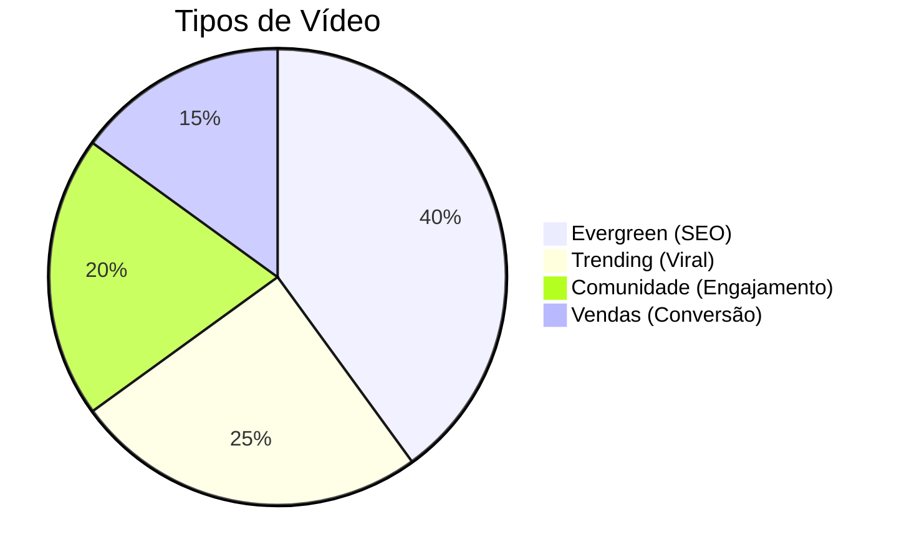

# 🎬 MONETIZAÇÃO YOUTUBE - GUIA DEFINITIVO

---

## Programa de Parcerias YouTube (YPP)

### Requisitos atuais:

| Requisito | Quantidade |
|-----------|------------|
| Inscritos | 1.000 |
| Horas assistidas | 4.000 (12 meses) |
| OU Visualizações Shorts | 10M (90 dias) |
| Conta AdSense | Vinculada |
| Conformidade | Políticas OK |

### Quanto se ganha com AdSense:

**CPM médio por nicho (Brasil):**

| Nicho | CPM (R$) | 1M views = |
|-------|----------|------------|
| Finanças | R$15-40 | R$15-40k |
| Tech | R$10-25 | R$10-25k |
| Educação | R$8-20 | R$8-20k |
| Negócios | R$12-30 | R$12-30k |
| Lifestyle | R$4-12 | R$4-12k |
| Games | R$3-10 | R$3-10k |
| Entretenimento | R$3-8 | R$3-8k |
| Vlogs | R$2-6 | R$2-6k |

**Fórmula:**
```
RECEITA = (Visualizações ÷ 1000) × CPM × 0,55*

*YouTube fica com 45%
```

---

## Outras Formas de Monetização

### Membros do Canal

**Níveis sugeridos:**

| Nível | Preço | Benefícios |
|-------|-------|------------|
| Bronze | R$7,99 | Badge + emojis |
| Prata | R$14,99 | + Vídeos exclusivos |
| Ouro | R$29,99 | + Lives privadas |
| Diamante | R$49,99 | + Comunidade VIP |

### Super Chat e Super Thanks

- **Super Chat:** Mensagens destacadas em lives
- **Super Thanks:** Gorjetas em vídeos
- **Super Stickers:** Figurinhas pagas

**Potencial:** R$500-10.000/mês (dependendo da audiência)

### YouTube Shopping

- Vincule produtos na descrição
- Crie seção de loja
- Marque produtos durante vídeos
- Comissão de afiliado ou produtos próprios

---

## Patrocínios no YouTube

### Tipos de integração:

| Tipo | Descrição | Valor médio |
|------|-----------|-------------|
| Menção | 15-30s falando da marca | R$500-2.000 |
| Integração | 1-3min demonstrando | R$2.000-10.000 |
| Dedicado | Vídeo inteiro sobre | R$5.000-50.000 |
| Série | Múltiplos vídeos | R$10.000-100.000 |

### Calculando seu valor:

```
VALOR BASE = Views médias × R$0,05 a R$0,20

Exemplo: 50.000 views médias
Valor: R$2.500 a R$10.000 por integração
```

---

## Estratégia de Conteúdo para Monetização

### Mix de conteúdo ideal:



### Formatos lucrativos:

| Formato | Potencial AdSense | Potencial Patrocínio |
|---------|-------------------|----------------------|
| Tutorial | ⭐⭐⭐⭐⭐ | ⭐⭐⭐⭐ |
| Review | ⭐⭐⭐⭐ | ⭐⭐⭐⭐⭐ |
| Lista (Top 10) | ⭐⭐⭐⭐ | ⭐⭐⭐ |
| Comparativo | ⭐⭐⭐⭐ | ⭐⭐⭐⭐ |
| Vlog | ⭐⭐ | ⭐⭐⭐ |
| Shorts | ⭐ | ⭐⭐ |

---

## SEO para YouTube

### Otimização de vídeo:

**1. Título (60 caracteres)**
- Palavra-chave no início
- Número se possível
- Curiosidade/benefício

**2. Descrição (5000 caracteres)**
```
[Resumo em 2-3 linhas com palavra-chave]

🔗 LINKS MENCIONADOS:
- Link 1
- Link 2

📚 CAPÍTULOS:
00:00 Introdução
01:30 [Tópico 1]
05:00 [Tópico 2]

🎁 RECURSOS GRATUITOS:
- [Link para isca]

📱 ME SIGA:
- Instagram: @
- TikTok: @

#hashtag1 #hashtag2 #hashtag3
```

**3. Tags**
- Palavra-chave principal
- Variações
- Relacionadas
- Nome do canal

**4. Thumbnail**
- Rosto com expressão
- Texto grande (3-5 palavras)
- Cores contrastantes
- Preview do conteúdo

---

## Crescimento no YouTube

### Métricas importantes:

| Métrica | Meta | Por que importa |
|---------|------|-----------------|
| CTR | +4% | Thumbnail + Título |
| Retenção | +50% | Qualidade do conteúdo |
| Watch time | Máximo | Algoritmo prioriza |
| Engajamento | Alto | Comentários, likes |

### Estratégias de crescimento:

1. **Consistência** - Postar no mesmo dia/horário
2. **Séries** - Criar playlists conectadas
3. **Colaborações** - Canais do mesmo tamanho
4. **Shorts** - Alimentar o algoritmo
5. **Comunidade** - Usar aba de comunidade
6. **Lives** - Criar conexão

---

## 🔗 Links Relacionados
- [[04 - Monetização Instagram]]
- [[06 - Monetização TikTok]]
- [[08 - Produtos Digitais]]
- [[Ideas Extraordinárias - Monetização e Escala]]

#youtube #adsense #monetização #patrocínio #seo
