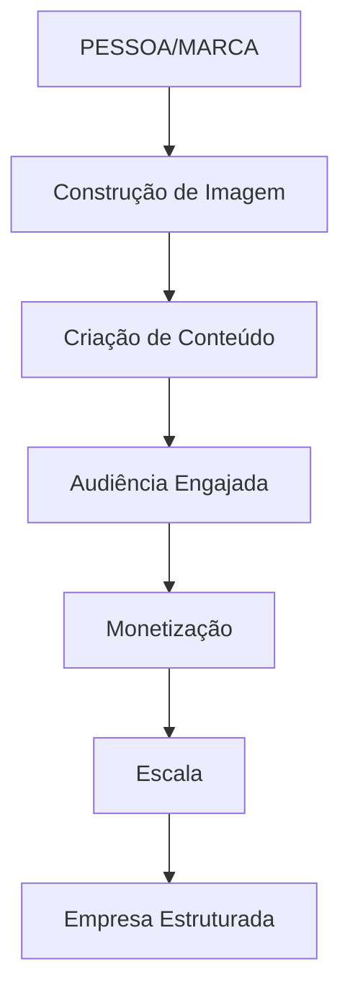

# 💡 IDEAS EXTRAORDINÁRIAS
## Sistema Completo de Monetização, Escala e Estruturação Empresarial

> **Missão:** Transformar sua imagem, ideias e conhecimento em um negócio lucrativo, legal, escalável e acessível para sua audiência.

---

# 📚 ÍNDICE

1. [[01 - Personal Branding]]
2. [[02 - Construção da Imagem]]
3. [[03 - Estrutura Empresarial]]
4. [[04 - Monetização Instagram]]
5. [[05 - Monetização YouTube]]
6. [[06 - Monetização TikTok]]
7. [[07 - Outras Plataformas]]
8. [[08 - Produtos Digitais]]
9. [[09 - Funil de Vendas]]
10. [[10 - Precificação]]
11. [[11 - Gestão Financeira]]
12. [[12 - Automação e Sistemas]]
13. [[13 - Equipe e Delegação]]
14. [[14 - Escala e Crescimento]]
15. [[15 - Plano de Ação]]

---

# 🎯 VISÃO GERAL DO SISTEMA



---

# 📊 OS 4 PILARES DA MONETIZAÇÃO DIGITAL

## 1. 🧑‍💼 PESSOA (Personal Branding)
- [ ] Definir nicho de atuação
- [ ] Criar narrativa pessoal autêntica
- [ ] Estabelecer autoridade no assunto
- [ ] Documentar a jornada (storytelling)

## 2. 💡 IDEIA (Proposta de Valor)
- [ ] Qual problema você resolve?
- [ ] Para quem você resolve?
- [ ] Como você resolve de forma única?
- [ ] Por que as pessoas pagariam por isso?

## 3. 🏢 EMPRESA (Estrutura Legal)
- [ ] MEI / ME / LTDA (escolher formato)
- [ ] CNPJ ativo e regularizado
- [ ] Conta PJ separada
- [ ] Emissão de notas fiscais
- [ ] Contabilidade em dia

## 4. 📈 ESCALA (Crescimento)
- [ ] Automações e sistemas
- [ ] Equipe/delegação
- [ ] Múltiplas fontes de receita
- [ ] Reinvestimento estratégico

---

# 💰 FONTES DE MONETIZAÇÃO POR PLATAFORMA

## 📸 Instagram
| Método | Requisitos | Potencial |
|--------|-----------|-----------|
| Parceria com marcas | 10k+ seguidores engajados | ⭐⭐⭐⭐⭐ |
| Venda de produtos próprios | Loja configurada | ⭐⭐⭐⭐⭐ |
| Afiliados | Links na bio/stories | ⭐⭐⭐ |
| Consultorias/Mentorias | Autoridade no nicho | ⭐⭐⭐⭐ |
| Bônus Reels | Programa Meta | ⭐⭐ |
| Close Friends pago | Conteúdo exclusivo | ⭐⭐⭐⭐ |

## 🎬 YouTube
| Método | Requisitos | Potencial |
|--------|-----------|-----------|
| AdSense | 1k inscritos + 4k horas | ⭐⭐⭐ |
| Membros do canal | 1k inscritos | ⭐⭐⭐⭐ |
| Super Chat/Thanks | Lives ativas | ⭐⭐⭐ |
| Patrocínios | Audiência qualificada | ⭐⭐⭐⭐⭐ |
| Produtos próprios | Loja integrada | ⭐⭐⭐⭐⭐ |

## 🎵 TikTok
| Método | Requisitos | Potencial |
|--------|-----------|-----------|
| Fundo de criadores | 10k seguidores | ⭐⭐ |
| Lives (presentes) | 1k seguidores | ⭐⭐⭐ |
| TikTok Shop | Conta comercial | ⭐⭐⭐⭐ |
| Parcerias UGC | Portfólio | ⭐⭐⭐⭐⭐ |

---

# 🔄 FUNIL DE MONETIZAÇÃO

```
TOPO (Alcance)
├── Reels virais
├── Shorts/TikToks
├── Conteúdo SEO
└── Colaborações

MEIO (Engajamento)  
├── Stories diários
├── Lives semanais
├── Newsletter
└── Comunidade (Discord/Telegram)

FUNDO (Conversão)
├── Produtos digitais (R$47-197)
├── Mentorias em grupo (R$497-1997)
├── Consultoria 1:1 (R$2000+)
└── Produtos físicos/Serviços
```

---

# ✅ CHECKLIST FINANCEIRO (Tudo Certo e em Dia)

## Estrutura Básica
- [ ] CNPJ ativo (MEI até R$81k/ano)
- [ ] Certificado digital (se necessário)
- [ ] Conta bancária PJ
- [ ] Sistema de emissão de NF

## Obrigações Mensais
- [ ] DAS do MEI (até dia 20)
- [ ] Separar % para impostos
- [ ] Registrar todas as receitas
- [ ] Guardar comprovantes

## Controle Financeiro
- [ ] Planilha de fluxo de caixa
- [ ] Separar pessoal x empresa
- [ ] Reserva de emergência (6 meses)
- [ ] Reinvestimento planejado (20-30%)

---

# 🎯 METAS PARA ACOMPANHAR

| Período | Seguidores | Receita | Produtos |
|---------|------------|---------|----------|
| Mês 1 | | | |
| Mês 3 | | | |
| Mês 6 | | | |
| Mês 12 | | | |

---

# 🔗 Links Relacionados
- [[VRGS - Estrategia Instagram 2026]]
- [[Calendário de Conteúdo]]
- [[Planejamento Financeiro]]
- [[Banco de Ideias]]
- [[Ideas Extraordinárias.canvas]]

---

#monetização #instagram #youtube #empreendedorismo #escala #ideias
